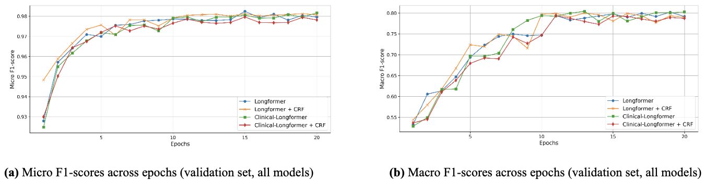
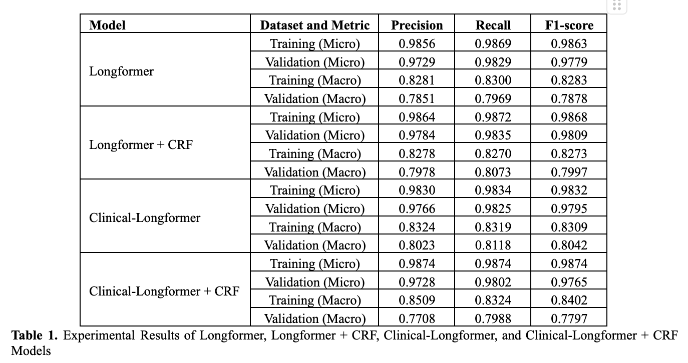

# Enhancing Privacy in Clinical Data: De-Identification of Electronic Health Record Text Using Longformer and CRF on the OpenDeID Dataset

## Introduction

This document outlines the experiment conducted to improve privacy in clinical data by de-identifying electronic health record (EHR) text. The model used combines **Longformer** and **Conditional Random Fields (CRF)** to extract and anonymize sensitive information from EHR text using the **OpenDeID** dataset.

The goal of this experiment is to demonstrate how deep learning can be used to enhance patient privacy by automatically identifying and removing protected health information (PHI) from clinical text.

## Environment
- **Python Version:** 3.x
- **Libraries:**
  - PyTorch
  - Huggingface Transformers
  - torchcrf (for CRF)
  - NumPy, Pandas

## Dataset
- Dataset Name: OpenDeID Dataset
- Source: [https://www.sredhconsortium.org/sredh-datasets/opendeid-corpus-dataset]
- Content: The dataset contains EHR text with labeled entities for PHI such as patient names, dates, and locations.

## Training
### Training Script
- Longformer Training [code/longformer_training.ipynb](https://github.com/danangwijaya750/Longformer-EHR-DeID/blob/master/code/longformer_training.ipynb)
- Longformer + CRF Training [code/longformer_CRF_training.ipynb](https://github.com/danangwijaya750/Longformer-EHR-DeID/blob/master/code/longformer_CRF_training.ipynb)
- Clinical Longformer Training [code/Clinical_longformer_training.ipynb](https://github.com/danangwijaya750/Longformer-EHR-DeID/blob/master/code/Clinical_longformer_training.ipynb)
- Clinical Longformer + CRF [code/Clinical_longformer_CRF_training.ipynb](https://github.com/danangwijaya750/Longformer-EHR-DeID/blob/master/code/Clinical_longformer_CRF_training.ipynb)
### Training Statistic Output Files
Each training script have an output json file
- Longformer Training [code/longformer_training.ipynb](https://github.com/danangwijaya750/Longformer-EHR-DeID/blob/master/code/training_stat_longformer.json)
- Longformer + CRF Training [code/longformer_CRF_training.ipynb](https://github.com/danangwijaya750/Longformer-EHR-DeID/blob/master/code/training_stat_longformerCRF.json)
- Clinical Longformer Training [code/Clinical_longformer_training.ipynb](https://github.com/danangwijaya750/Longformer-EHR-DeID/blob/master/code/Clinical_training_stat_longformer.json)
- Clinical Longformer + CRF [code/Clinical_longformer_CRF_training.ipynb](https://github.com/danangwijaya750/Longformer-EHR-DeID/blob/master/code/Clinical_training_stat_longformerCRF.json)
## Inference
use this script to perform the inference
- Inference code [code/inference_code.ipynb](https://github.com/danangwijaya750/Longformer-EHR-DeID/blob/master/code/inference_code.ipynb)
## Results
### Overall model performance

## Acknowledgement

## Citation
If you find this repository is helpfull, please cite our paper :
